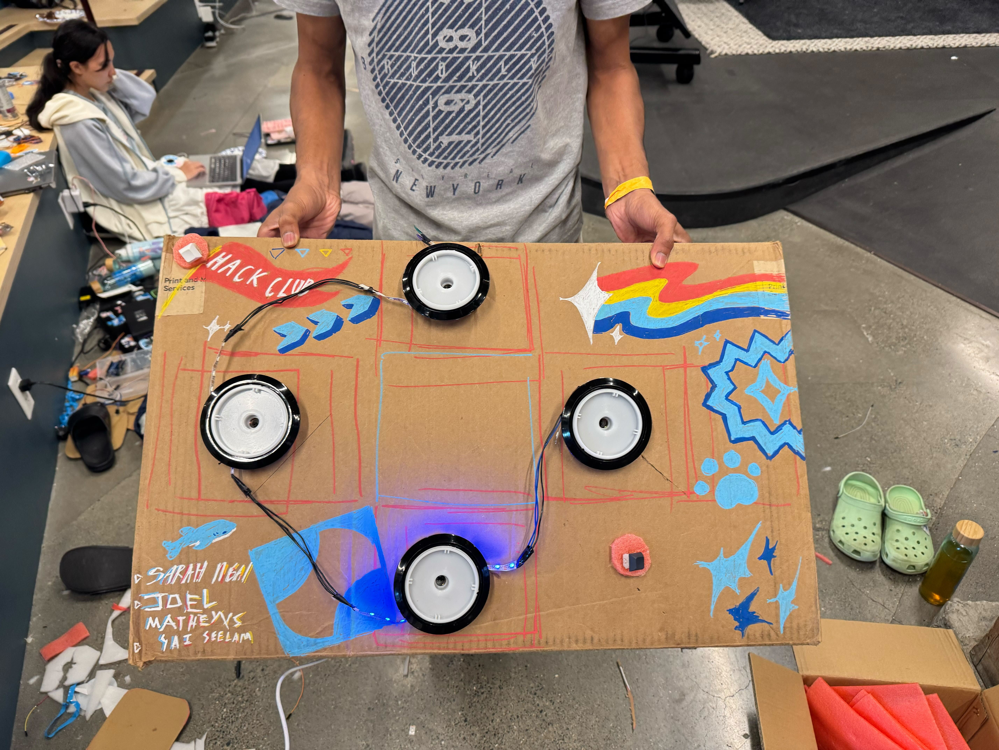
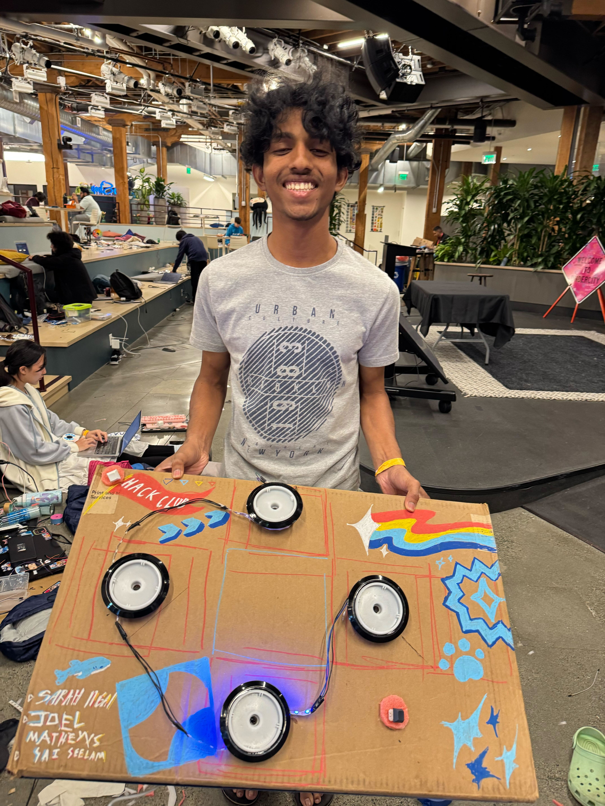
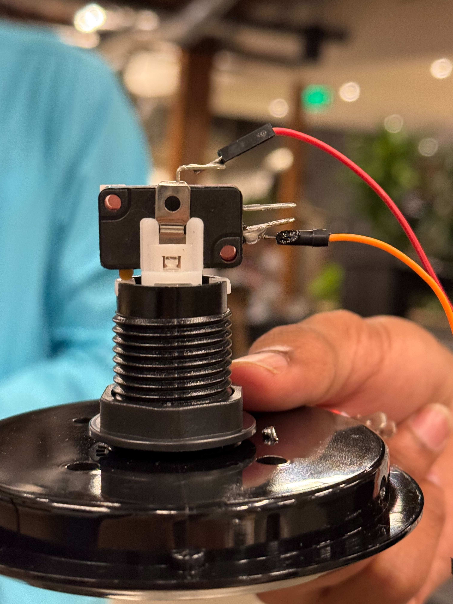
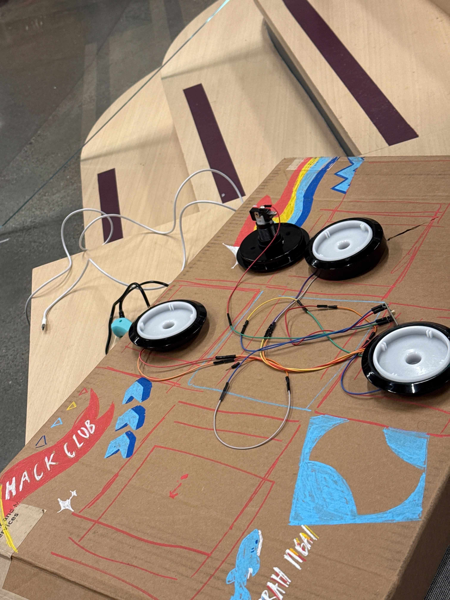

# cardboard box

A scrappy 6-button LED dance pad emulating a Dance Dance Revolution pad — can be used for rhythm games like **Friday Night Funkin'** and other 4-key movement games. Includes **Enter** and **Escape** keys on top of the standard WASD/Arrow layout.

Built for **Hack Club Undercity** because we thought it'd be fun and my friend won't stop playing FNF IDK TBH.

---

## BOM

| Item                    | Quantity | Notes                  |
|-------------------------|----------|------------------------|
| Orpheus Pico            | 1        | Microcontroller        |
| Buzzers (with switches) | 4        | Act as the buttons     |
| Jumper wires (M/F)      | —        | For wiring everything  |
| Cables                  | —        | Any usable wires       |
| USB-C Cable             | 1        | For power & flashing   |
| Trash Box               | 1        | Housing / case         |
| Solder                  | —        |                        |
| Soldering Iron          | 1        | Required to solder     |

---

## Firmware

- [CircuitPython for Orpheus Pico](https://circuitpython.org/board/orpheus_pico/)

--
## the PROCESS
-we decapitated a button + world's worst soldering job

woiring..

