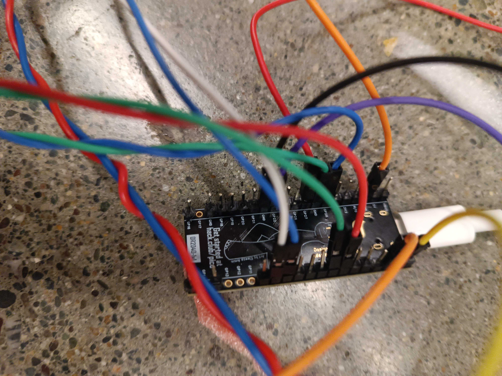

# cardboard box

scrappy 6-button LED dance pad emulating a dance dance revolution pad — can be used for rhythm games like **friday night funkin'** and other 4-key games. also includes **enter** and **escape** keys on top of the standard wasd layout.

built for **hack club undercity** because my friend won't stop playing fnf lol.

---

## BOM

| item                    | quantity | notes                  |
|-------------------------|----------|------------------------|
| orpheus pico            | 1        | microcontroller        |
| buzzers (with switches) | 4        | act as the buttons     |
| jumper wires (m/f)      | —        | for wiring             |
| cables                  | —        | any usable wires       |
| usb-c cable             | 1        | for power & flashing   |
| trash cardboard box     | 1        | housing / case         |
| solder                  | —        |                        |
| soldering Iron          | 1        | required to solder     |

---

## firmware

- [circuitpython for orpheus pico](https://circuitpython.org/board/orpheus_pico/)

--
## the PROCESS
-we decapitated a button + world's worst soldering job

woiring..

world's worst. contrapatin

